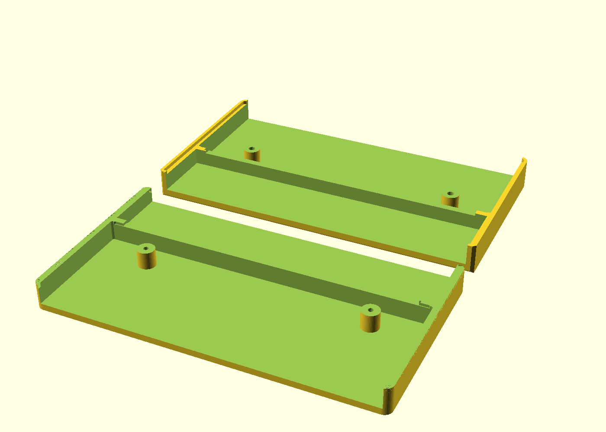
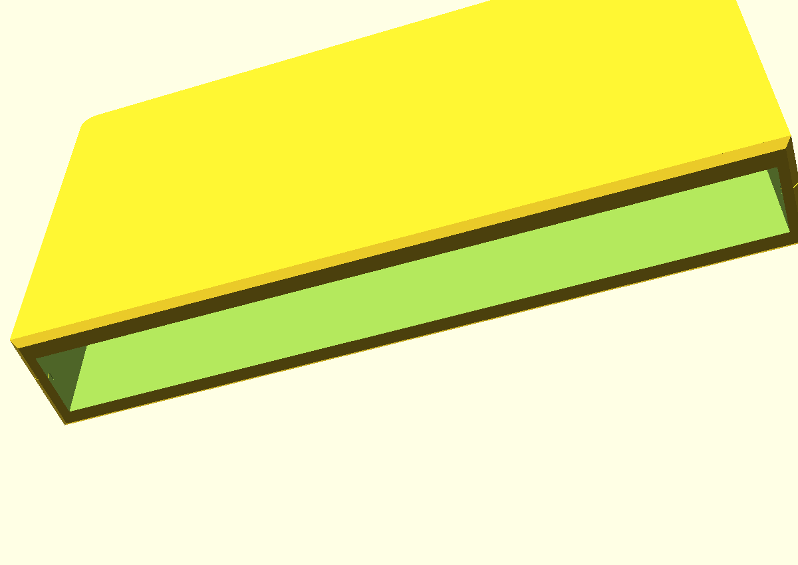
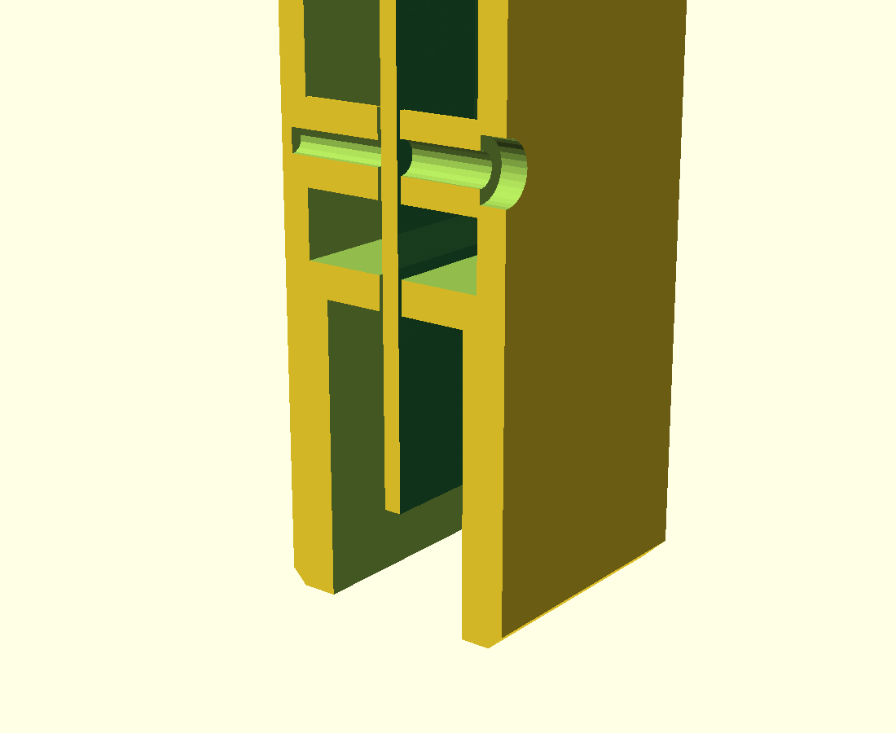

# mech/ — the printed shell

A two-part enclosure for the adapter. The console end is built like a real
cartridge's — the shell carries on past the gold fingers as a skirt and the fingers
sit recessed inside a **mouth** that the console's 72-pin connector rises into. The
top is open so the Game Genie plugs straight into the edge connector.



**106.1 × 16.8 × 58.4 mm** — the width and thickness are a real cartridge's. Two M2
screws. No supports, no glue, nothing else printed.

```
make            front.stl + back.stl
make gauge      the fit gauge — PRINT THIS FIRST
make render     the five PNGs in this directory
make params     re-export board.scad after a change to the PCB
```

## The console end



Those measurements were taken against a front loader, which does not weaken them
here: the top loader and the front loader take the same 72-pin connector and the same
cartridge, by design. One cart fits both, so a cart's mouth clears both connectors —
and everything in this table is a dimension *of the cartridge*, not of a console.
Console-shell features (tray posts, guide ribs, clamp pads) would not transfer, and
none of them are in this model.

| | | |
|---|---|---|
| skirt | fingers recess **7 mm** up inside the mouth | caliper on a real cart: 7.08; interference-scanning a cart through an assembled shell bounds it to 6.64–7.02 |
| mouth | **101.3 × 10.4 mm** opening | sized for the console's connector **body** (~100 × 10 mm), not for the fingers — the body is what rises into the pocket |
| lips | **3.4 mm** back face, **3.0 mm** label face | what is left of the 16.8 mm thickness either side of the mouth |
| open depth | **19.7 mm** from the bottom face | leaves **12.7 mm** of card for the connector to reach, which is exactly what a real cart leaves |
| bulkhead | closes the cavity above the mouth | the card edge seats on it; a real cart uses 1.4 mm per half, this is 2.2 mm |
| chamfer | **1 mm** at 45° round the bottom face | the lead-in; without it the shell catches on its own square edge |
| outer | **106.1 mm** wide, **16.8 mm** thick | a cart's connector-end width and its full thickness |

A guess of 1 mm for that recess failed a dry fit once, which is why it is a measured
number and not a plausible one.

## Before you print

**The board and the console end are measured. The Game Genie's edge connector is
not.** It is a bought part nobody here has calipered, and the defaults in
`enclosure.scad` are a plausible 95 × 11 × 12 mm — check yours and correct them:

| parameter | what to measure |
|---|---|
| `CONN_L` | body length, along the board |
| `CONN_D` | body depth, across the board — **this sets how thick the whole shell is** |
| `CONN_H` | body height above the board's top edge |
| `CONN_OVERLAP` | how far the body reaches down past that edge, if at all |

Then **print the fit gauge**. It is the bottom 33 mm of both halves — the mouth, the
bulkhead, the card seat, a screw pillar and the lap joint — and it answers every
tolerance question the full shell does except the Game Genie connector's. Check that
the board seats on the bulkhead without forcing, that the two halves close with no
gap, and — since printed walls come out where your printer puts them, not where the
model says — that it drops onto the console and sits down.

If the board is tight, raise `FIT` (0.25 → 0.35). If the halves rock, lower `LAP_CLR`.

## How it holds together



Three things, in order of the load they take:

**The bulkhead.** The wall that closes the mouth off from the cavity above it. The
board's shoulders — where the 93.5 mm tongue widens to the 99.7 mm body — seat on its
top face, which is also the hard stop that says how far into the console the board can
go. Pushing a Game Genie into the connector presses the board *down* onto it, so
insertion force lands on a 2.2 mm shelf instead of on the screws. A real cart does the
same job with a 1.4 mm bulkhead in each half.

**The pillars.** Two posts per half, on the board's own 2.1 mm mounting holes, which
is what those holes turn out to be good for. They set the board on the centre plane
and clamp it. They are also, deliberately, **plastic**: several traces pass within
1.5 mm of each hole, and a metal screw head torqued onto soldermask over copper can
abrade through it. The pillar is the washer. Do not counterbore the head down onto the
board.

**The screws.** 2 × M2 × 14 mm thread-forming, front to back, into a blind 1.65 mm
pilot. `enclosure.scad` prints the length it computes on every run, so it follows the
parameters if you change them.

**And a lap joint** around the wall, because the board's holes are at z=22.2 and the
shell continues for another 29 mm above them with nothing clamping it. A step around
the side walls means the top of the seam cannot open. Pegs were tried first and there
is nowhere to put them — the interior width *is* the board width plus the fit, so
anything inside the body lands on the board.

## Printing

| | |
|---|---|
| orientation | each half flat on its **outer** face — the face that ends up on the outside |
| supports | none needed; every overhang is a hole in the bed face or a wall |
| layers | 0.2 mm |
| walls | 3 perimeters (the shell is 2 mm, so this makes it solid) |
| material | PLA is fine. PETG or ABS if it will live plugged into a warm console |

The STLs in this directory are committed and are what `make` produces. They go through
`canonical_stl.py` on the way out: CGAL emits facets in an unstable order, so without
that a committed STL would be "modified" by every build and a real change would be
invisible in the diff. Same reasoning as `pcb/canonicalize.py`.

## The board dimensions are not typed in here

`board.scad` is **generated** by `gen_params.py` from `pcb/lib/geometry.py` — the same
file the PCB itself is built from. Outline, tongue, thickness, mounting holes: one
source, two consumers. Change the board and run `make params`.

It does flip the vertical axis on the way through, and that is the thing to watch if
you edit the generator: KiCad's y grows *downward* toward the insertion edge, while
the model stands the board up with z=0 at the finger tips. A model built without the
flip is upside down and looks entirely plausible, because the board is nearly
symmetrical top to bottom.

## Files

| file | |
|---|---|
| `enclosure.scad` | the model — all parameters at the top, grouped by what they affect |
| `board.scad` | GENERATED board geometry — do not edit |
| `gen_params.py` | writes `board.scad` from the PCB source |
| `canonical_stl.py` | sorts STL facets so the output is byte-reproducible |
| `front.stl`, `back.stl` | the printable halves |
| `render_*.png` | print layout, both halves, the mouth, and the section above |
